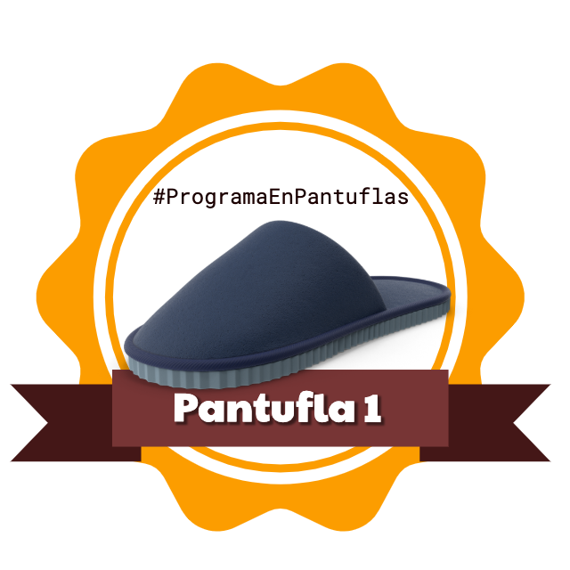
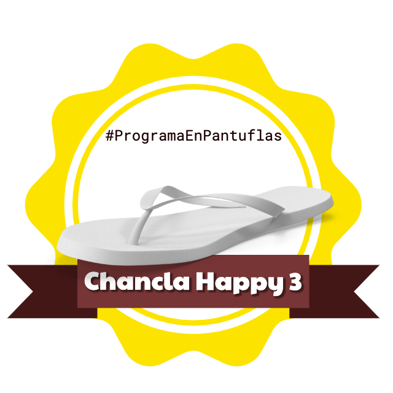

# programa-en-pantuflas

## **Tu diario empieza aquí**

Estoy participando en el reto [#ProgramaEnPantuflas](https://github.com/delineas/reto-programa-en-pantuflas).

### Insignias
<!-- markdownlint-disable MD033-->

       

---
​
**Fecha**: 11/02/2021

**Humor**: 😀

**Hitos conseguidos**:

- Finalizar proyecto Data Warehouse #yey
- 2 ejercicios de Python Morsels

**Próximos hitos**:

- Revisar configuraciones pendientes de HomeAssistant
- Empezar módulo 4 Data Lakes
- Planificar componentes para nuevo equipo

---
​
**Fecha**: 04/02/2021

**Humor**: 😀

**Hitos conseguidos**:

- Mantener rutinas

**Próximos hitos**:

- Finalizar proyecto Data Warehouse
- 2 ejercicios de Python Morsels
- Revisar configuraciones pendientes de HomeAssistant

---
​
**Fecha**: 28/01/2021

**Humor**: 😀

**Hitos conseguidos**:

- Mantener rutina de lectura diaria
- Dos salidas semanales a correr.
- Terminar modulo 3 del curso de ingeniería de datos
- Organizar actividad social en http://gather.town/

**Próximos hitos**:

- Finalizar proyecto Data Warehouse
- 2 ejercicios de Python Morsels
- Revisar configuraciones pendientes de HomeAssistant

---

**Fecha**: 21/01/2021

**Humor**: 😐

**Hitos conseguidos**:

- Mantener rutina de lectura diaria

**Próximos hitos**:

- Terminar modulo 3 del curso de ingeniería de datos
- Dos salidas semanales a correr.

---

**Fecha**: 14/01/2021

**Humor**: 😀

**Hitos conseguidos**:

- Resolución de un problema al día en Python Morsels
- Iniciada rutina de lectura diaria

**Próximos hitos**:

- Profundizar un poco más en OLAP y Datawarehousing
- Terminar modulo 3 del curso de ingeniería de datos

---

**Fecha**: 07/01/2021

**Humor**: 😀

**Hitos conseguidos**:

- Retomar Python Morsels

**Próximos hitos**:

- Profundizar un poco más en OLAP y Datawarehousing
- Rutina de lectura diaria

---
